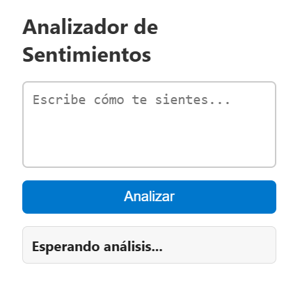

# 🐧 Analizador de emociones.

Bienvenido al proyecto **Analizador de emociones**: una aplicación web que sirve para analizar texto y a partir de este determinar el estado de animo del usuario. 
---

## 🌟 ¿Qué hace este proyecto?
- Analiza sentimientos usando un modelo de lenguaje entrenado en español (`beto-sentiment-analysis`).
- Muestra un pingüino 3D (`.glb`) que reacciona a los sentimientos.
- Cambia el color del panel lateral según la emoción detectada.
- Muestra una onomatopeya flotante (¡Genial!, Hmm..., ¡Ay no!) sobre el pingüino.
- Permite hacer clic en el espacio 3D para mover al pingüino (simulando movimiento tipo *Club Penguin*).
  
---

## 🧠 Tecnologías usadas

### Backend
- Python 3
- Flask
- HuggingFace Transformers (`beto-sentiment-analysis`)
- Torch (PyTorch)

### Frontend
- HTML5 + CSS3
- JavaScript
- [Three.js](https://threejs.org/) (para visualización 3D)
- GLTFLoader (para cargar el modelo `.glb`)

---

## ⚙️ Cómo funciona

1. El usuario escribe un texto en español.
   
   
2. Al presionar "Analizar", el texto se envía al backend Flask.
 
4. El backend utiliza un modelo de clasificación de sentimientos entrenado para devolver:
   - El sentimiento (`POSITIVO`, `NEUTRO`, `NEGATIVO`)
   - El nivel de confianza
5. El frontend cambia el fondo del panel lateral, anima el modelo 3D y muestra una onomatopeya sobre el pingüino con la reacción.

---

## 🏫 Hecho para la Escuela Politécnica Nacional

> Proyecto académico para la materia de Inteligencia Ariticial

---

## 🧑‍💻 Autores

Sebas Ramos – [GitHub](https://github.com/tu-usuario)
Juan Mateo Quisilema - [GitHub](https://github.com/JuanMateoQ)

---

## ⚠️ Licencia

Este proyecto está bajo la licencia MIT.  
Puedes usarlo, modificarlo y distribuirlo libremente con atribución.

